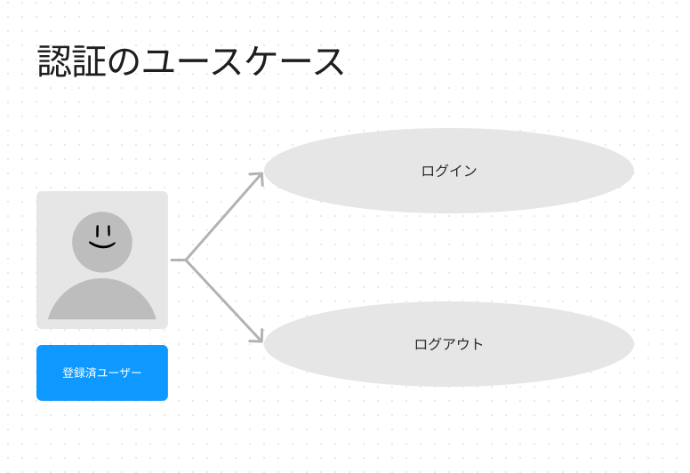
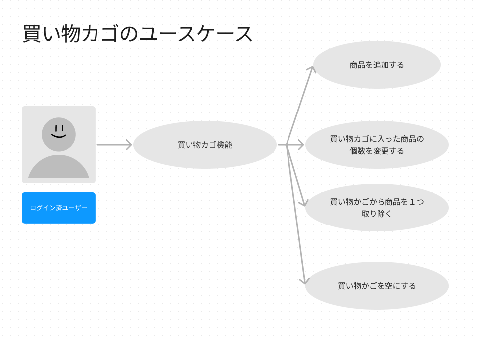

# 概要
BtoC向けのECショップのクローンサイトのバックエンド側です。 
実在するサイトでいうと、イ〇ンネットスーパーや、杏〇堂ネットスーパーのようなサイトです。 
作っている理由としては以下の２点です。 
1.Webアプリケーションを１通り実装できるようにする。 
2.ネットスーパーを日頃使っているので、基本的な仕様は把握しているため。 

フロント側のリポジトリは以下リンクです。 
https://github.com/RYA234/ecshop_front_react

# ドメイン
## ユースケース

### 認証機能

### ユーザー登録機能

### 商品機能

### 買い物カゴ機能

### 決済機能

### 注文機能

# 非ドメイン

## 開発環境
| 名称               | バージョン     | 説明                                 |
|------------------|-----------|------------------------------------|
| Windows10        |           | OS                                 |
| IntelliJ         | Community | IDE 無料版                            |
| Java             | 11        | 言語                                 |
| SpringBoot       | 2.7       | フレームワーク                            |
| SpringSecurity   | 5.7       | 認可認証に使う                            |
| SpringDataJpa    |           | リポジトリレイヤーで利用                       |
| JUnit            | 5         | テストフレームワーク                         |
| Mockito          |           | テストフレームワーク　モックするときに使う              |
| H2 DataBase      |           | インメモリーデータベース。リポジトリレイヤーの単体テストに使います。 |
| mySQL            | 8.0.2.9   | データベース                             |
| mySQL Workbench  |           | mySQLのデータベースを確認するためのクライアントソフト      |
| Swagger          | 3.00      | APIドキュメンテーション化ツール                  |
| Postman(デスクトップ版) |           | APIのE2Eテストするツール                    |
| Github           |           | ソース管理                              |

## ソフトウェアアーキテクチャー
Controller-Service-Repositoryパターンのアーキテクチャです。

## フォルダ構成
ルートフォルダはsrc/main/kotlin 

| 親パス                        | パス        | 説明                                                                                  |
|----------------------------|-----------|-------------------------------------------------------------------------------------|
| src/main/kotlin/com/example/restapi | domain    | ユースケースのドメイン領域です。EntityとServiceクラスがあります。                                             |
| src/main/kotlin/com/example/restapi | implement | ソフトウェア依存領域です。具体的にはController,ServiceImplement Swagger SpringSecurityのConfigなどがあります。 |
| src/test/kotlin/com/example| restapi   | ユニットテストが入っているフォルダです。                                                                |

# セッティング方法

## MySQLでの設定

## SpringBootの起動方法

# swaggerUI
swaggerでUIを確認できます。

# 実装した時のメモ
qiitaでの記録です。

# 参考資料

